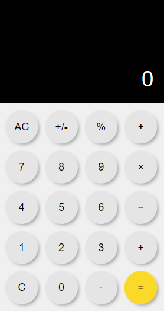

<h1 align="center">
  Calcualdora
</h1>

## Tecnologias

Esse projeto foi desenvolvido com as seguintes tecnologias:

- HTML
- CSS
- JavaScript

## Projeto

O projeto consiste em uma calculadora simples com o objetivo principal de desenvolvimento de competências a respeito de funcionalidades do JavaScript.

## Layout

Esse é o layout do projeto

Até o momento esse layout e a usabilidade foi pensada somente para dispositivos móveis, o que implica em distorções quando acessado em outros tamanhos de tela.

## Acesso

O projeto pode ser acessado e testado [aqui](https://gabrielpdb.github.io/calculator/)

Made by [GabrielPDB](https://github.com/GabrielPDB)
